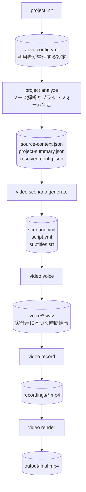

# auto-product-video-generator

APVGはgit管理されたプロジェクトを解析し、口語的なデモシナリオを生成して、実際のアプリを録画し、
ナレーションと字幕を合成したプロモーション動画を作成します。Web、CLI、Android系、Unityに対応します。

English documentation: [README.md](./README.md)

## 対応機能

| 対象                             | 録画方法                                          |
| -------------------------------- | ------------------------------------------------- |
| Web                              | Playwright Chromium                               |
| CLI                              | Docker内のターミナルをPlaywrightで録画            |
| Android / Flutter / React Native | adb端末またはエミュレーター                       |
| Unity                            | Build Settingsで有効なSceneをUnity Recorderで録画 |

LLMはGemini、OpenAI、Claude、Groq、ローカルOllamaに対応します。音声はVOICEVOXと
AI Talkを複数定義でき、Sceneごとに交互に使用できます。

## インストールと実行

Node.js 20以降とgitが必要です。VOICEVOXとCLI録画にはDockerを使用します。
録画対象に応じてPlaywright、Android SDK、Unityも必要です。

```bash
npm install --global auto-product-video-generator
apvg setup
apvg doctor
```

作業用ディレクトリで、リモートリポジトリまたは既存のローカルgitプロジェクトを指定します。

```bash
mkdir my-product-video
cd my-product-video

apvg project init --repo https://github.com/you/your-app.git
# または: apvg project init --source ../your-app

apvg serve
apvg video generate
```

`project init`でUnityやAndroid用のフラグを付ける必要はありません。プラットフォームは
`project analyze`で判定します。Webの`--url`を省略した場合も解析時に推定します。

## パイプラインと中間ファイル

`video generate`は次の5段階をまとめて実行します。



```text
project analyze
  → video scenario generate
  → video voice
  → video record
  → video render
```

生成物を確認・編集したい場合は個別に実行できます。

```bash
apvg project analyze
apvg video scenario generate
apvg video voice
apvg video record
apvg video render
```

| コマンド                       | 主な生成物                                                                  |
| ------------------------------ | --------------------------------------------------------------------------- |
| `apvg project init`            | `apvg.config.yml`                                                           |
| `apvg project analyze`         | `.apvg/source-context.json`、`project-summary.json`、`resolved-config.json` |
| `apvg video scenario generate` | `.apvg/scenario.yml`、`script.yml`、`subtitles.srt`                         |
| `apvg video voice`             | `.apvg/voice/*.wav`と実音声に基づく時間情報                                 |
| `apvg video record`            | `.apvg/recordings/*.mp4`、`.apvg/screenshots/scene-*.png`                  |
| `apvg video render`            | `output/final.mp4`と`output/artifacts/`                                     |

`apvg.config.yml`は利用者が管理する設定ファイルです。解析処理はconfigを書き換えません。
検出したプラットフォーム、URL、起動コマンドは`.apvg/resolved-config.json`へ保存され、
後続処理がメモリ上でconfigと統合します。

再実行には`video generate`の`--skip-analyze`、`--skip-scenario`、
`--skip-voice`、`--skip-record`、`--no-screenshots`を使用できます。
`video record`でも`--no-screenshots`を指定できます。`video voice`と`video record`は
`--scene <id>`による個別実行にも対応します。

## 設定

`project init`が初期設定を生成します。全項目をコメント付きで確認する場合は
[examples/apvg.config.yml](./examples/apvg.config.yml)を参照してください。

```yaml
project:
  name: My product

source:
  localPath: ../my-product
  # projectPath: apps/web
  # environmentFile: /secure/path/product.env

# 自動判定する場合はtargetを省略できます。

video:
  type: demo
  # duration: 90 # 省略するとシナリオの長さを制限しない
  screenshots: true # 各シーンの最終表示画面を1枚ずつPNG保存する
  scenarioPrompt: |
    親しみやすい口語的な説明にしてください。
    キャラクターの話し方を一貫させてください。
  subtitles: true
  singleLineSubtitles: true

llm:
  provider: ollama
  model: qwen2.5:7b-instruct

voice:
  profiles:
    - name: first
      type: voicevox
      url: http://localhost:50021
      speakerId: 1
    - name: second
      type: voicevox
      url: http://localhost:50021
      speakerId: 3

output:
  workDir: ./.apvg
  dir: ./output
```

音声profileは宣言順にSceneへ割り当て、末尾まで使用すると先頭へ戻ります。
`video.subtitles: false`または`video render --no-subtitles`で字幕なしにできます。
既定は字幕ありです。

### 環境変数プレースホルダー

YAML内のすべての文字列で`${ENVIRONMENT_KEY}`を使用できます。configと同じ場所の
`.env`と`.env.local`、任意の`voice.envFile`を読み込みます。展開はメモリ上だけで行い、
秘密値や展開結果を`apvg.config.yml`へ書き戻しません。

### AI Talk

```yaml
voice:
  profiles:
    - type: aitalk
      url: https://webapi.aitalk.jp/webapi/v5/ttsget.php
      speakerName: nozomi
      username: ${AITALK_USERNAME}
      password: ${AITALK_PASSWORD}
      options:
        speed: 1.0
        pitch: 1.0
        range: 1.0
        style: # YAMLのマッピング。合計は1.0以下
          j: 0.5 # 喜び
          s: 0.2 # 悲しみ
          a: 0.1 # 怒り
```

対応する`ttsget`オプションはexample configに記載しています。`style`を指定した場合は
固定値を使用し、省略した場合だけLLMがSceneの文章に適した感情を選びます。
[AI Talk Web API TTSGet](https://www.ai-j.jp/manual/business/webapi/5/modules/Api/TTSGet.html)

## プラットフォーム別録画

### Webと認証

起動コマンドとlocalhost URLは可能な範囲で自動検出します。必要なら
`source.startCommand`と`target.url`で上書きできます。認証が必要な画面では
`target.auth`を設定して`apvg auth login`を一度実行します。生成されるPlaywrightの
storage stateには認証情報が含まれるため、commitやartifactへのアップロードはしないでください。

### CLI

`package.json`とソース構造からCLIを判定し、一時Dockerコンテナ内で実行します。
自動生成シナリオが実行できるのは、有限で読み取り専用のhelp/version系コマンドだけです。
それ以外は`target.cli.allowedCommands`へ完全一致で追加します。拒否パターンが常に優先されます。

### Android、Flutter、React Native

一般的なdebug APKのビルド、AVDの選択・起動、APKのインストール、adb録画を自動化します。
`target.android`はpackage、activity、端末、AVD、APK、build command、SDKなどの
自動検出を上書きするときだけ指定します。

### Unity

対象プロジェクトへ`com.unity.recorder`を導入し、録画対象SceneをBuild Settingsで
有効にしてください。

```bash
apvg project init --source ../MyUnityProject
apvg project analyze
apvg video scenario generate
apvg video voice
apvg video record
apvg video render
```

APVGは`ProjectSettings/ProjectVersion.txt`からEditorを特定します。Unityプロジェクトを
一時ディレクトリへコピーして管理下のC# Recorderを追加し、複数Sceneを1回のEditor起動で録画します。
元のUnityプロジェクトは変更しません。自動検出できない場合だけ`target.unity.editorPath`または
`UNITY_EDITOR_PATH`を指定します。Scene順は`target.unity.scenes`で上書きできます。

Unity Recorderの出力は全OS共通でWebM中間ファイルとし、その後FFmpegでH.264/AACのMP4へ
変換します。GitHub-hosted Ubuntuでも仮想ディスプレイとソフトウェアOpenGLを使って同じ経路を通ります。

## 動画素材の一括変換

動画生成とは独立して、ディレクトリ内の素材を一括変換できます。

```bash
apvg video convert --input-dir ./素材 --output-dir ./converted --format mp4 --recursive
```

AVI、M4V、MKV、MOV、MP4、WebMを読み込めます。出力はMP4またはWebMです。
既存ファイルを置き換える場合は`--overwrite`を指定します。

## Remotionプロジェクトへの出力

timelineと素材の生成後、編集可能なプロジェクトを独立して出力できます。

```bash
apvg video export remotion
cd output/remotion-project
npm install
npm run dev
```

通常のNode.js + TypeScriptプロジェクトとして、動画、音声、字幕、時間情報が接続された状態で
生成されます。APVGは依存関係をインストールせず、lockfileも生成しません。`--output`で
出力先を指定し、空でない既存ディレクトリへ出力する場合は`--force`を使用します。

## GitHub Action

```yaml
jobs:
  video:
    runs-on: ubuntu-latest
    timeout-minutes: 360
    steps:
      - uses: actions/checkout@v6
      - id: apvg
        uses: TakuKobayashi/auto-product-video-generator@v1
        with:
          video-type: demo
          export-remotion: 'true'
          # Unityの場合だけ必要
          unity-email: ${{ secrets.UNITY_EMAIL }}
          unity-password: ${{ secrets.UNITY_PASSWORD }}
          # 省略時は現在サポートするUnity Hubの既定バージョンを使用します
          unity-hub-version: '3.21.1'
      - uses: actions/upload-artifact@v7
        with:
          name: promotional-video
          path: ${{ steps.apvg.outputs['artifacts-path'] }}
```

Composite Actionは解析、シナリオ、音声、録画、レンダー、任意のRemotion出力を個別stepで
実行します。解析結果がUnityの場合だけ対応Editorを導入・認証し、Xvfbを起動して、
ディスプレイとFFmpegを確認してから録画します。Unity以外ではUnity関連処理をすべてスキップします。
Ubuntu/Linux runner、Docker、`sudo`が必要です。

主なinputは`repository`、`ref`、`project-path`、`target-url`、`video-type`、
`ollama-model`、`voicevox-speaker`、`output-directory`、`preview`、
`export-remotion`です。outputは`video-path`、`artifacts-path`、
`remotion-project-path`です。

リポジトリ内のworkflowは役割が異なります。`main-video-build.yml`はcheckoutしたソースを
直接ビルドして動作確認し、`generate-demo.yml`はMarketplace／Composite Actionを検証します。
どちらも解析後のUnity条件分岐に対応します。

## リポジトリ開発

Taskfileは既定でnpm互換コマンドを使用します。

```bash
npm install
task build
task doctor
```

pnpmを使用する場合は`task build PACKAGE_MANAGER=pnpm`のように指定できます。

## ライセンス

MIT
