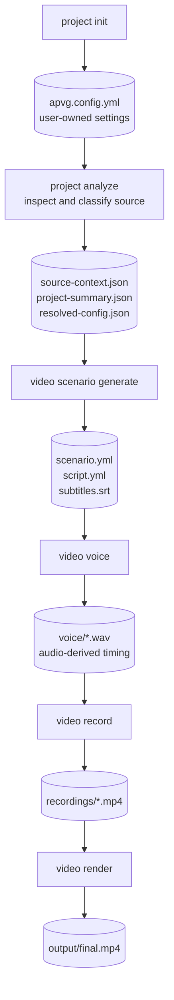

# auto-product-video-generator

APVG analyzes a git-managed product, generates a conversational demo scenario,
records the real application, synthesizes narration, and renders a promotional
video. It supports web, CLI, Android-family, and Unity projects.

Japanese documentation: [README-ja.md](./README-ja.md)

## What it supports

| Project                          | Recording method                                           |
| -------------------------------- | ---------------------------------------------------------- |
| Web                              | Playwright Chromium                                        |
| CLI                              | Isolated Docker terminal recorded with Playwright          |
| Android / Flutter / React Native | adb device or emulator                                     |
| Unity                            | Enabled Build Settings scenes recorded with Unity Recorder |

APVG can use Gemini, OpenAI, Claude, Groq, or local Ollama models. Narration can
alternate between multiple VOICEVOX and AI Talk profiles.

## Install and run

Node.js 20 or newer and git are required. Docker is required for VOICEVOX and
CLI recording. Platform-specific recording also needs Playwright, Android SDK,
or Unity as described below.

```bash
npm install --global auto-product-video-generator
apvg setup
apvg doctor
```

Create a working directory and initialize it with either a remote repository or
an existing local git project:

```bash
mkdir my-product-video
cd my-product-video

apvg project init --repo https://github.com/you/your-app.git
# Or: apvg project init --source ../your-app

apvg serve
apvg video generate
```

`project init` detects the platform later during analysis; it does not require a
Unity or Android flag. When `--url` is omitted, web URL detection is also deferred
to analysis.

## Pipeline and intermediate files

The all-in-one command runs these five stages:



```text
project analyze
  → video scenario generate
  → video voice
  → video record
  → video render
```

Run them separately when you want to inspect or edit generated material:

```bash
apvg project analyze
apvg video scenario generate
apvg video voice
apvg video record
apvg video render
```

| Command                        | Main output                                                                 |
| ------------------------------ | --------------------------------------------------------------------------- |
| `apvg project init`            | `apvg.config.yml`                                                           |
| `apvg project analyze`         | `.apvg/source-context.json`, `project-summary.json`, `resolved-config.json` |
| `apvg video scenario generate` | `.apvg/scenario.yml`, `script.yml`, `subtitles.srt`                         |
| `apvg video voice`             | `.apvg/voice/*.wav` and audio-derived timing                                |
| `apvg video record`            | `.apvg/recordings/*.mp4`, `.apvg/screenshots/scene-*.png`                   |
| `apvg video render`            | `output/final.mp4` and `output/artifacts/`                                  |

`apvg.config.yml` remains user-owned. Analysis never writes detected values back
to it; inferred platform, URL, and start command are stored in
`.apvg/resolved-config.json` and merged in memory by later stages.

Useful rerun options include `--skip-analyze`, `--skip-scenario`, `--skip-voice`,
`--skip-record`, and `--no-screenshots` on `video generate`, plus `--scene <id>`
and `--no-screenshots` on `video record`.

## Configuration

Generate a starter file with `project init`. The complete commented reference is
[examples/apvg.config.yml](./examples/apvg.config.yml). Common customization:

```yaml
project:
  name: My product

source:
  localPath: ../my-product
  # projectPath: apps/web
  # environmentFile: /secure/path/product.env

# target may be omitted when analysis should detect it.

video:
  type: demo
  # duration: 90 # omit for unrestricted scenario length
  scenarioPrompt: |
    Keep the narration friendly and conversational.
    Give the character a consistent verbal style.
  subtitles: true
  singleLineSubtitles: true

llm:
  provider: ollama
  model: qwen2.5:7b-instruct

voice:
  profiles:
    - name: first
      type: voicevox
      url: http://localhost:50021
      speakerId: 1
    - name: second
      type: voicevox
      url: http://localhost:50021
      speakerId: 3

output:
  workDir: ./.apvg
  dir: ./output
```

Scenes use voice profiles in declaration order and wrap around. Set
`video.subtitles: false`, or pass `video render --no-subtitles`, to render
without subtitle overlays. Subtitles are enabled by default.

### Environment placeholders

Every YAML string supports `${ENVIRONMENT_KEY}`. APVG automatically loads `.env`
and `.env.local` next to the config, plus the optional `voice.envFile`. Values are
expanded only in memory and are never written back to `apvg.config.yml`.

### AI Talk

```yaml
voice:
  profiles:
    - type: aitalk
      url: https://webapi.aitalk.jp/webapi/v5/ttsget.php
      speakerName: nozomi
      username: ${AITALK_USERNAME}
      password: ${AITALK_PASSWORD}
      options:
        speed: 1.0
        pitch: 1.0
        range: 1.0
        style: # YAML mapping; total must be 1.0 or less
          j: 0.5 # joy
          s: 0.2 # sadness
          a: 0.1 # anger
```

All supported `ttsget` options are shown in the example config. When `style` is
present it is fixed. When omitted, scenario generation asks the LLM to select a
suitable emotion for each scene. API reference:
[AI Talk Web API TTSGet](https://www.ai-j.jp/manual/business/webapi/5/modules/Api/TTSGet.html).

## Platform recording

### Web and authentication

APVG detects a start command and localhost URL when possible. Override them with
`source.startCommand` and `target.url`. For authenticated pages, configure
`target.auth`, run `apvg auth login` once, and keep the generated Playwright
storage state secret.

### CLI

CLI projects are detected from `package.json` and source structure. Commands run
inside a temporary Docker container. Generated scenarios only run finite,
read-only help/version commands unless exact commands are added to
`target.cli.allowedCommands`; denied patterns always take precedence.

### Android, Flutter, and React Native

APVG can build a conventional debug APK, select or start an AVD, install the APK,
and record through adb. Use `target.android` only to override automatic package,
activity, serial, AVD, APK, build command, or SDK detection.

### Unity

Install `com.unity.recorder` in the target project and enable the scenes to record
in Build Settings:

```bash
apvg project init --source ../MyUnityProject
apvg project analyze
apvg video scenario generate
apvg video voice
apvg video record
apvg video render
```

APVG finds the Editor version from `ProjectSettings/ProjectVersion.txt`, copies
the project to a temporary directory, injects its maintained C# recorder, records
the enabled scenes in one Editor session, and leaves the original project
unchanged. Set `target.unity.editorPath` or `UNITY_EDITOR_PATH` only when automatic
detection is insufficient; `target.unity.scenes` can override scene order.

Unity Recorder produces WebM intermediates on every OS. APVG converts them to
H.264/AAC MP4 with FFmpeg before normal rendering. GitHub-hosted Ubuntu runs use
the same path with a virtual display and software OpenGL.

## Video conversion

Normalize all video material in a directory independently of generation:

```bash
apvg video convert --input-dir ./素材 --output-dir ./converted --format mp4 --recursive
```

Supported inputs include AVI, M4V, MKV, MOV, MP4, and WebM. Output can be MP4 or
WebM; add `--overwrite` to replace existing conversions.

## Export an editable Remotion project

After rendering has produced a timeline and assets:

```bash
apvg video export remotion
cd output/remotion-project
npm install
npm run dev
```

The export is an independent Node.js + TypeScript project with connected video,
audio, subtitle, and timing data. APVG does not install dependencies or create a
lockfile. Use `--output` to choose a directory and `--force` to overwrite a
non-empty destination.

## GitHub Action

```yaml
jobs:
  video:
    runs-on: ubuntu-latest
    timeout-minutes: 360
    steps:
      - uses: actions/checkout@v6
      - id: apvg
        uses: TakuKobayashi/auto-product-video-generator@v1
        with:
          video-type: demo
          export-remotion: 'true'
          # Required only when analysis detects Unity:
          unity-email: ${{ secrets.UNITY_EMAIL }}
          unity-password: ${{ secrets.UNITY_PASSWORD }}
          # Optional; defaults to the current supported Unity Hub version.
          unity-hub-version: '3.21.1'
      - uses: actions/upload-artifact@v7
        with:
          name: promotional-video
          path: ${{ steps.apvg.outputs['artifacts-path'] }}
```

The composite action runs analysis, scenario generation, narration, recording,
rendering, and optional Remotion export as separate steps. After analysis, Unity
projects conditionally install and activate the matching Editor, start Xvfb, and
record its selected scenes. Other platforms skip all Unity setup. The action
requires an Ubuntu/Linux runner with Docker and `sudo`.

Key inputs are `repository`, `ref`, `project-path`, `target-url`, `video-type`,
`ollama-model`, `voicevox-speaker`, `output-directory`, `preview`, and
`export-remotion`. Outputs are `video-path`, `artifacts-path`, and
`remotion-project-path`.

The manual `generate-demo.yml` workflow supports private SSH repository URLs.
Add the private deploy key as its `SSH_KEY` repository secret; the corresponding
public key must have read access to the target repository.

The repository workflows have different roles: `main-video-build.yml` directly
builds and exercises the checked-out source, while `generate-demo.yml` verifies
the Marketplace/composite action. Both conditionally support Unity after project
analysis.

## Repository development

The Taskfile defaults to npm-compatible commands:

```bash
npm install
task build
task doctor
```

Developers who prefer pnpm can pass `PACKAGE_MANAGER=pnpm`, for example
`task build PACKAGE_MANAGER=pnpm`.

## License

MIT
